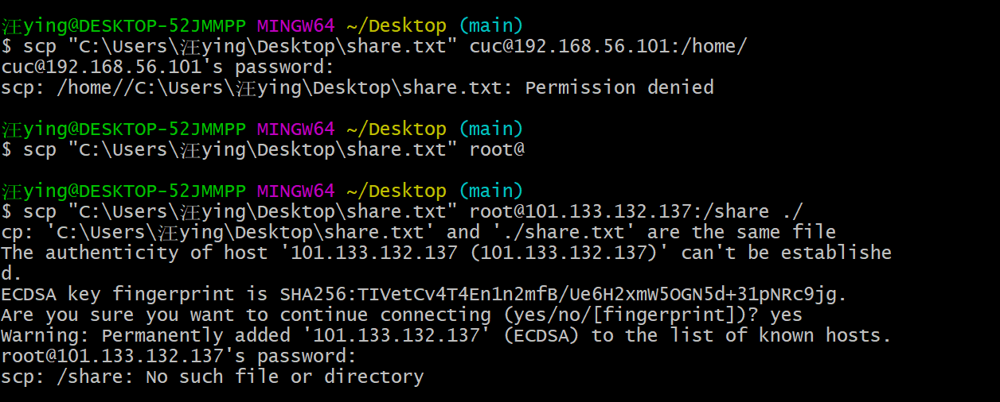

#H1 实验
###汪莹华 2020212063002

>调查并记录实验环境的如下信息：左侧为阿里云平台，右侧为Ubuntu，里面仍旧有很多问题未完全改善，请老师和助教指证
####当前 Linux 发行版基本信息
```bash
lsb_release -a
cat /etc/issue
cat /etc/os-release
cat /etc/*release*
```


####当前 Linux 内核版本信息
```bash
uname -a
cat /proc/version
dmesg | grep Linux
```


####Virtualbox 安装完 Ubuntu 之后新添加的网卡如何实现系统开机自动启用和自动获取 IP？
通过`ifconfig`命令查看网卡

通过`sudo vim /etc/netplan/00-installer-config.yaml`修改网卡参数如下图所示。

最终执行`sudo netplan apply`生效


####如何使用 scp 在「虚拟机和宿主机之间」、「本机和远程 Linux 系统之间」传输文件？
本机和远程 Linux 系统之间:
`scp "C:\Users\汪ying\Desktop\share.txt" root@101.133.133.44`
虚拟机和宿主机之间：
`scp "C:\Users\汪ying\Desktop\share.txt" cuc@192.168.56.101`
（但好像没有成功？)


####如何配置 SSH 免密登录？
1.通过`ssh-keygen` 来生成密钥
2.通过`ssh-copy-id`命令实现密钥远程登陆
```bash
ssh-copy-id -i ~/.ssh/id_rsa.pub root@101.132.223.166
```
3.验证是否成功


####遇到的问题与解决方法：
1.一开始不知道理解是发行版和内核版本，只知道跟着老师的指令去做。
后来在csdn中搜到了具体解析。https://blog.csdn.net/zhaihaibo168/article/details/102673669


2.输入ifconfig -a后显示如图问题，只需按照下行`sudo apt install net-tools`输入即可


3.现在仍存在的问题就是还是没有搞懂每一行代码出现在此的理由，模仿大于理解，希望以后可以慢慢改善这个问题。

####其他参考资料（以网站形式罗列）
https://blog.csdn.net/xiongyangg/article/details/110206220
https://www.cnblogs.com/hanwen1014/p/9048717.html
