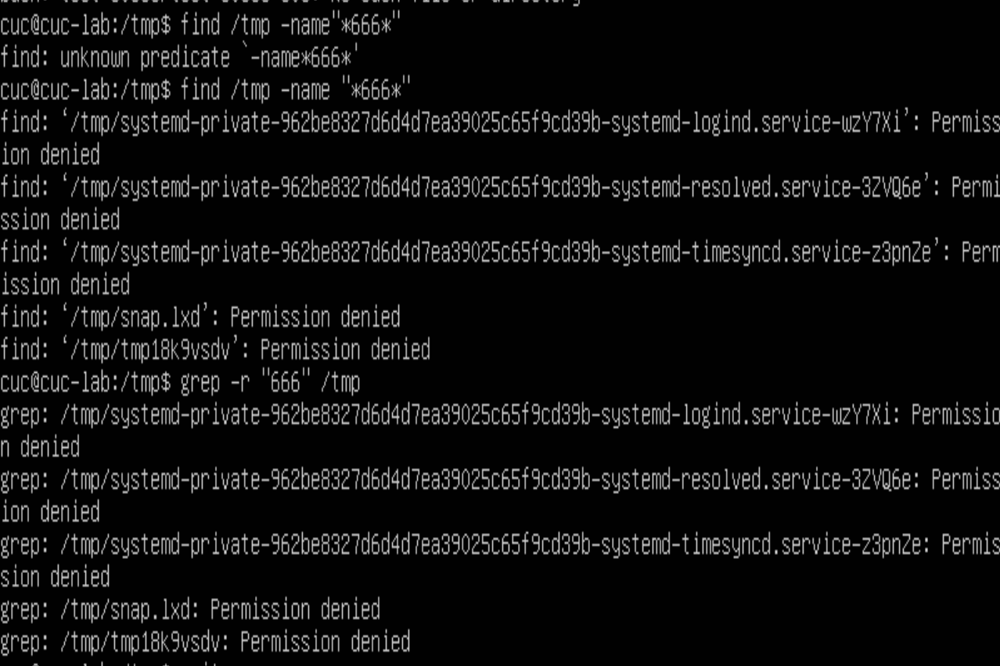
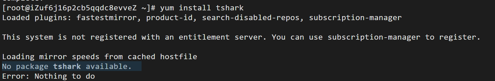

#H2 实验
###汪莹华 2020212063002

####使用表格方式记录至少 2 个不同 Linux 发行版本上以下信息的获取方法，使用 asciinema 录屏方式「分段」记录相关信息的获取过程和结果（主要为asciinema录屏，所以并未罗列太多图片）

####【软件包管理】
>在目标发行版上安装 tmux 和 tshark ；查看这 2 个软件被安装到哪些路径；卸载 tshark ；验证 tshark 卸载结果

| 版本 | Ubuntu | CentOS |
|----- | ----- | ------  |
|安装应用|`sudo apt install`|`yum install`|
|查看安装路径|`dpkg -L` |`rpm -qal | grep`|
|卸载应用|`sudo apt-get purge`|`yum remove`|

·安装两个软件：
Ubuntu：https://asciinema.org/a/UdWbUaLJxZxSp7aIoMyrbtRmR
出现了紫屏，为了确认安装成功我再次执行了该命令。(但后来经过助教答疑我明白了这里并不是什么报错，而是在配置非超级用户的流量监控权限)

CentOS：https://asciinema.org/a/bUGguNjJoChfHpnXXZSacJ9eG
·查看安装路径：
Ubuntu：https://asciinema.org/a/loWe9QAX6e8QwnUSZ3grMjoSB
CentOS：https://asciinema.org/a/WhIxtj3CP1BnQDVVFKnWyKKhZ
·卸载应用并验证：
卸载tshark后，我用查看安装路径验证了tshark卸载成功。
Ubuntu：https://asciinema.org/a/dXrm0V3yFPreMvhc3bwa7gGJe
CentOS：https://asciinema.org/a/M1QOrtqcdP2iR1zhw3ElJ4lZA

####【文件管理】
>复制以下 shell 代码到终端运行，在目标 Linux 发行版系统中构造测试数据集，然后回答以下问题：
找到 /tmp 目录及其所有子目录下，文件名包含 666 的所有文件
找到 /tmp 目录及其所有子目录下，文件内容包含 666 的所有文件

| 版本 | Ubuntu | CentOS |
| ----- | ----- | ------ |
|文件名查找|`find /tmp -name"*666*"`|`find /tmp -name "*666*"`
|文件内容查找|`grep -r "666" /tmp`|`find . | xargs grep -ri "666"`
Ubuntu：https://asciinema.org/a/gX0OeFOsZq1aLAmufQjDcd7pe

CentOS：https://asciinema.org/a/kPO8YULiyKO2vJWWuwXG2zDho

####【文件压缩与解压缩】
>练习课件中 文件压缩与解压缩 一节所有提到的压缩与解压缩命令的使用方法

| 版本 | Ubuntu | CentOS |
|----- | ----- | ------  |
|zip压缩/解压|`zip` / `unzip -o`|`zip` / `unzip -o`|
|gzip压缩/解压|`gzip` / `gzip -dv`|`gzip` / `gzip -dv`|
|tar压缩/解压|`tar -cvf` / `tar -xvf`|`tar -cvf` / `tar -xvf`|
|bzip2压缩/解压|`bzip2` / `bunzip2`|`bzip2` / `bunzip2`|
|7z压缩/解压|`7z a -t7z -r` / `7z x 1.7z -r -o./`|`7za a -t7z` / `7za x 1.7z -r -o./`|
|rar压缩/解压|`rar a` / `rar x`|`zip`/`unzip -o`|

####【子进程管理实验】
均遇到了`ping www.baidu.com & `后难以退出的问题。
Ubuntu：https://asciinema.org/a/8gAZYo0COyEtyNws7P2WTcnJD
CentOS：https://asciinema.org/a/sBzEROVMn4EC7sXQ2yW4qC9cn

####【硬件信息获取】
>目标系统的 CPU、内存大小、硬盘数量与硬盘容量

| 版本 | Ubuntu | CentOS |
|----- | ----- | ------  |
|CPU信息|`cat /proc/cpuinfo |grep 'model name'`|`grep 'model name' /proc/cpuinfo`|
|内存大小|`cat /proc/meminfo |grep MemTotal`|`grep MemTotal /proc/meminfo`|
|硬盘数量|`sudo fdisk -l |grep Disk`|`fdisk -l |grep Disk`|
|硬盘容量|`sudo fdisk -l |grep Disk`|`fdisk -l |grep Disk`|

Ubuntu：https://asciinema.org/a/UVII8ctkjhWNuMNW6NS5T5Ttf
CentOS：https://asciinema.org/a/p3xD4jgCPQSffZjRVbXj4PCvN

####问题与反思
1.CentOS情况下安装tshark失败（No package tshark available），实际上是因为CentOS 中 tshark 包含在 wireshark 中（通过 yum whatprovides *tshark* 可以查找到），yum install wireshark 即可。

2.子进程管理实验跟练遇到了`ping www.baidu.com & `后难以退出的问题，后来询问助教老师，才发现实际上是遗漏了`fg`